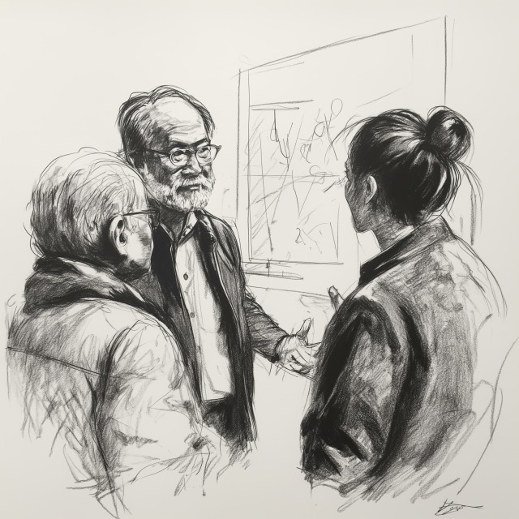

# Research and Development Phase

| Work : **Researchers** |
| Buy-In : **Researchers**, **Protocol Developers** |

The first step in building support for your idea should be to get
researchers and developers on board.

At a very high level, this will generally involve:

 * Describing your idea at a level suitable for [optech](https://bitcoinops.org/)
 * Comparing your idea to similar ideas from the past
 * Documenting the tradeoffs of your idea versus other approaches
 * Taking feedback about the drawbacks and trying to fix them
 * Building simulations and getting researchers to poke holes in them
 * Work on theoretical security proofs

The main goals at this phase should be:

 * To save time if your idea has previously been explored
 * To ensure the problem space is well understood
 * To brainstorm alternative solutions before investing too much time and effort
 * To have widely acceptable metrics for how changes in this space make things
   better or worse

Previous: [Roles](roles)

Next: [Power User Exploration](power)
